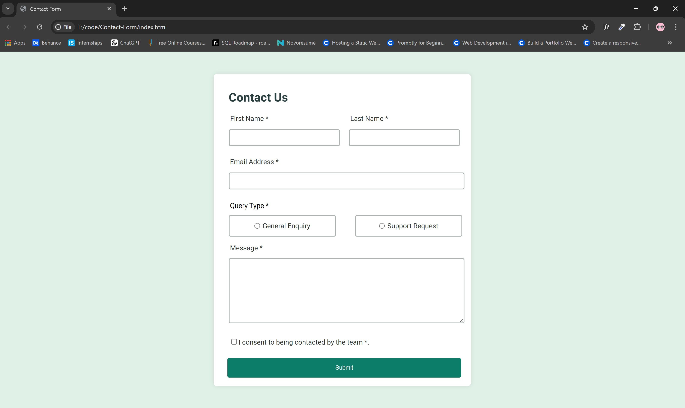
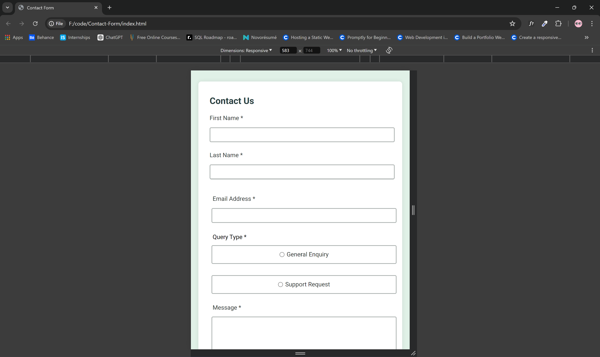

<article>
<h1>Contact Form Challenge</h1>

This challenge is to build a responsive and accessible contact form based on the provided design. This form should validate inputs, handle submission, and provide clear feedback to users.

<h2>Objective</h2>
<ul>
    <li>Build a contact form that closely matches the provided design.</li>
    <li>Ensure the form is fully accessible, allowing users to navigate and interact using keyboard only.</li>
    <li>Implement form validation for required fields and email format using JavaScript.</li>
    <li>Show success message (toast) upon successful form submission.</li>
    <li>Provide hover and focus states for interactive elements.</li>
    <li>Optimize layout for different screen sizes (responsive design).</li>
</ul>

<h2>Technologies Used</h2>
<ul>
    <li>HTML5</li>
    <li>CSS3 (Flexbox for layout, media queries for responsiveness)</li>
    <li>JavaScript (Vanilla JS for form validation and submission)</li>
</ul>

<h2>Preview</h2>

Desktop Preview:- 

Mobile Preview

Live Demo 
<a href="https://contact-form-by-yashi.netlify.app/">https://contact-form-by-yashi.netlify.app/</a>

<h2>Features</h2>
<ul>
    <li>Accessible form with ARIA attributes for screen readers.</li>
    <li>Error messages for missed required fields and incorrect email format.</li>
    <li>Tooltips for interactive elements.</li>
    <li>Responsive design for desktop and mobile screens.</li>
    <li>Submission success message displayed in a toast.</li>
</ul>

<h2>Installation</h2>
<ol>
    <li>Clone the repository: 
        <code>git clone https://github.com/Yashi-Singh-1/Contact-Form.git</code>
    </li>
    <li>Open <code>index.html</code> in your web browser.</li>
</ol>

<h2>Contributing</h2>

Contributions are welcome! Follow these steps:

<ol>
    <li>Fork the repository.</li>
    <li>Create your feature branch (<code>git checkout -b feature/YourFeature</code>).</li>
    <li>Commit your changes (<code>git commit -am 'Add some feature'</code>).</li>
    <li>Push to the branch (<code>git push origin feature/YourFeature</code>).</li>
    <li>Create a new Pull Request.</li>
</ol>

<h2>Author</h2>

Yashi Singh

<h2>LinkedIn Profile</h2>

Visit my LinkedIn profile: https://www.linkedin.com/in/yashi-singh-b4143a246 

</article>

